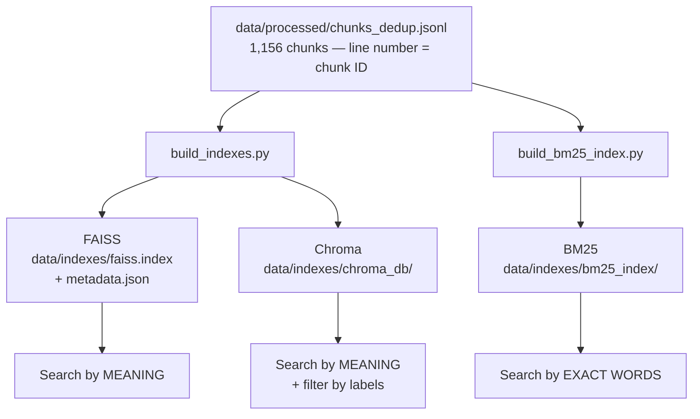
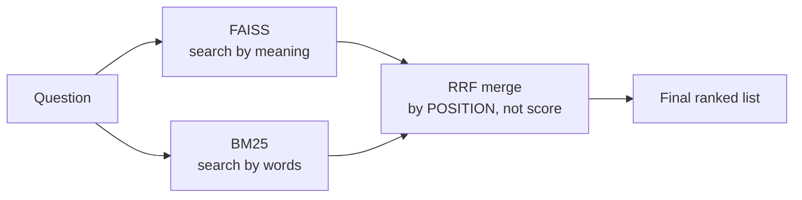
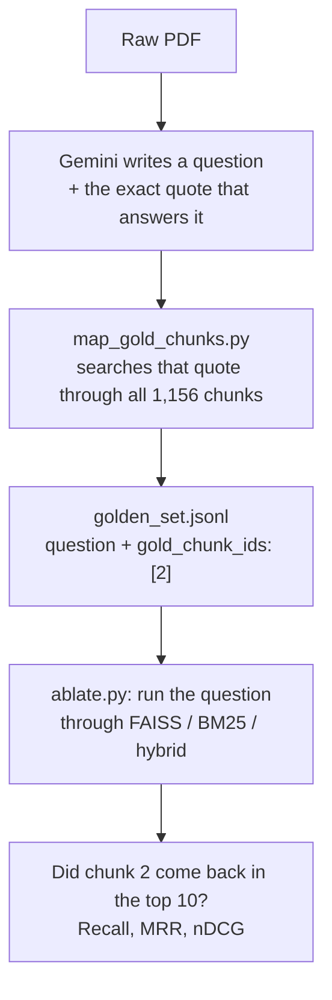

# Indexing & Storage Architecture (Phase 1 + Phase 2)

This document explains, in plain language, **where the text goes after it is parsed**, **why the project keeps three different search stores**, and **what every file inside `data/indexes/` is for**.

It covers what has actually been built in Phase 1 and Phase 2, plus the BM25 store added at the start of Phase 3, because the three stores only make sense when explained together.

---

## 1. The one idea to hold on to

> **Chunk the text once. Give every chunk a number. Store those same chunks in three different ways, so you can search them three different ways.**

That's the whole design. Everything below is detail.

After Phase 1's parsing and deduplication, we have **1,156 chunks** of text sitting in one file:

```
data/processed/chunks_dedup.jsonl
```

Each line of that file is one chunk. **The line number is the chunk's ID.** Line 0 is chunk 0, line 1 is chunk 1, and so on.

That single file is then fed into three different search stores. Every store keeps the same 1,156 items in the same order, so **chunk 2 means the same thing in all three**.



Why does this ID alignment matter so much? Because Phase 2's scoring depends on it. The golden set records answers as **chunk IDs** (`gold_chunk_ids: [2]`). If FAISS said "chunk 2" and BM25 meant a different chunk 2, none of the measurements would mean anything.

---

## 2. The three stores, explained simply

### FAISS — the "meaning" search

**What it is:** a library for finding the vectors closest to your query vector. Nothing more.

**The simple version:** every chunk of text is turned into a list of 768 numbers (a "vector") that captures roughly what the text *means*. Two chunks about the same topic end up with similar numbers. When you ask a question, your question is turned into 768 numbers too, and FAISS finds the chunks whose numbers are closest.

**Why it's useful:** it understands meaning, not just words. Ask *"how much money can I send abroad?"* and it can find a chunk that says *"remittance limits for individuals"* — no words in common, same meaning.

**Its limitation — and this is the important part:** FAISS only knows two things about your data — a vector, and an integer ID. It does **not** know the page number, the circular number, the date, or whether the document has been withdrawn. It is a library, not a database. If you want to know what chunk 2 actually *says*, you have to look it up yourself in a separate file.

That separate file is `metadata.json`.

### Chroma — the "meaning" search, in a real database

**What it is:** a vector database. It does the same closest-vector search as FAISS, but it also stores the text and the labels alongside each vector, and it can filter on those labels.

**The simple version:** imagine FAISS is a bag of vectors. Chroma is a filing cabinet — each vector is in a folder with the text, the PDF name, the page number, and any other labels attached.

**Why we want it:** RBI regulation changes. A rule that was correct in 2019 may have been withdrawn in 2021. An answer quoting a withdrawn rule is simply a *wrong* answer. So we need to be able to say "search, but only in documents that are still in force." Chroma can do this in a single query:

```python
collection.query(query_texts=["reporting requirement"],
                 n_results=10,
                 where={"is_superseded": False})   # the filter
```

### BM25 — the "exact words" search

**What it is:** classic keyword search, the same family of maths that powers Elasticsearch and Lucene.

**The simple version:** it scores each chunk on how well its *words* match your query's words. No meaning, no vectors — just words.

**Why it's essential here:** regulatory text is full of exact identifiers:

```
RBI/FED/2015-16/5
FED Master Direction No. 9/2015-16
DBR.No.BP.BC.45/21.04.048/2018-19
```

To a vector model, that's meaningless character soup — it has no "meaning" to capture, so the vector it produces is close to nothing useful. To BM25, it's a set of very rare, very specific words, which is exactly what BM25 is best at. Search for `Master Direction No. 18` and BM25 finds the chunk containing that string, ranked first.

This is the single clearest reason the project is called *hybrid* retrieval. Dense search and keyword search fail on opposite things, so we run both.

---

## 3. Side-by-side comparison

| | **FAISS** | **Chroma** | **BM25** |
|---|---|---|---|
| What kind of thing is it? | A library | A database | A library |
| Searches by | Meaning | Meaning | Exact words |
| Stores the text itself? | No | Yes | Yes |
| Stores labels (page, date)? | No — kept in a separate file | Yes | No |
| Can filter while searching? | **No** — filter afterwards | **Yes** — filter during | No |
| Good at circular numbers? | Bad | Bad | **Excellent** |
| Good at reworded questions? | **Excellent** | **Excellent** | Poor |
| Tunable internals? | **Yes** — Flat / HNSW / IVF | Hidden from you | k1, b |
| Size on disk here | 3.4 MB | 21 MB | 2.5 MB |
| Records held | 1,156 | 1,156 | 1,156 |

### The key difference: filtering *before* vs *after*

This is the real reason both FAISS and Chroma exist in this project.

**FAISS can only filter afterwards ("post-filter"):**

```
ask for top 10 by meaning  →  throw away the withdrawn ones  →  6 left
```

You asked for 10 and got 6. Worse, if the filter is narrow — *"only circulars issued after 2020"* — you might throw away all 10 and get nothing back, because the search and the filter know nothing about each other. The workaround is to fetch 100 and hope enough survive. That is a guess, not a guarantee.

**Chroma filters during the search ("pre-filter"):**

```
ask for top 10 by meaning, but only among documents still in force  →  10 valid results
```

You asked for 10 and got 10. The trade-off is that a narrow filter can make the search slower or slightly less accurate, because the filter blocks off the shortcuts the index normally uses to move quickly.

Neither approach wins everywhere — it depends on how narrow the filter is. For this corpus the question is a **correctness** question, not a speed question, which is exactly why the project builds both rather than assuming an answer.

---

## 4. The files used for indexing

### 4a. The scripts that build the indexes

| Script | Reads | Writes |
|---|---|---|
| `scripts/phase1/build_indexes.py` | `data/processed/chunks_dedup.jsonl` | `data/indexes/faiss.index`, `data/indexes/metadata.json`, `data/indexes/chroma_db/` |
| `scripts/phase3/build_bm25_index.py` | `data/processed/chunks_dedup.jsonl` | `data/indexes/bm25_index/` |

`build_indexes.py` does the expensive work **once**:

```python
embeddings = model.encode(batch, normalize_embeddings=True)   # BAAI/bge-base-en-v1.5
```

The chunks are embedded a single time, and those same vectors are written into both FAISS and Chroma. Embedding is the slow, costly step — doing it twice would be pure waste.

`build_bm25_index.py` never touches the embedding model at all. Keyword search needs no AI model, which is why it is fast and free to rebuild.

### 4b. What's inside `data/indexes/`

```
data/indexes/
├── faiss.index          3.4 MB   the 1,156 vectors
├── metadata.json        2.1 MB   the text + labels for those vectors
├── chroma_db/
│   ├── chroma.sqlite3   19 MB    text, labels and embedding records
│   └── <uuid>/          2 MB     the HNSW graph files
└── bm25_index/
    ├── vocab.index.json        68 KB    word → column number
    ├── data.csc.index.npy     388 KB    the scores
    ├── indices.csc.index.npy  388 KB    which document each score belongs to
    ├── indptr.csc.index.npy    40 KB    where each word's scores start
    ├── params.index.json      223 B     k1, b, method, num_docs
    ├── tokenizer_config.json   44 B     stemming + stopword settings
    ├── corpus.jsonl           1.7 MB    the chunk texts
    └── corpus.mmindex.json    8.5 KB    byte offsets into corpus.jsonl
```

#### `faiss.index` — the vectors

Pure numbers. 1,156 chunks × 768 dimensions × 4 bytes each = **3,551,232 bytes**, and the file is 3,551,277 bytes. The extra 45 bytes are the header. That arithmetic confirms it is an exact, uncompressed `IndexFlatIP` — every vector stored in full, every search comparing against all 1,156.

"Flat" means exhaustive and exact — no approximation, no speed tricks. At 1,156 chunks that is instant. It is also the honest baseline that HNSW and IVF get compared against later.

`IndexFlatIP` means "inner product." Because the vectors were normalised at build time (`normalize_embeddings=True`), inner product is mathematically the same as cosine similarity — the standard way to measure "how similar in meaning."

#### `metadata.json` — FAISS's address book

FAISS returns integers: `[2, 847, 15, ...]`. That's all it can return. This file turns those integers back into something meaningful.

It is a JSON array of 1,156 records, in the same order as the chunks. Record 2 is chunk 2. Each record looks like:

```json
{
  "text": "RBI/FED/2015-16/5\nFED Master Direction No. 9/2015-16  January 1, 2016 ...",
  "meta": {
    "pdf_name": "05MD56DF...PDF",
    "page_number": 0,
    "section_header": null,
    "circular_number": null,
    "issue_date": null,
    "is_superseded": false,
    "superseded_by": null,
    "chunk_index": 0,
    "total_chunks_in_doc": 1,
    "tenant_id": null,
    "acl": null,
    "extra": null
  }
}
```

**This file is the direct consequence of FAISS being a library and not a database.** Chroma needs no equivalent, because it keeps all of this internally.

#### `chroma_db/` — the vector database

- **`chroma.sqlite3`** — a normal SQLite database holding the documents, the labels, and the embedding records. It is 19 MB rather than FAISS's 3.4 MB because it stores the text and metadata too, not just the numbers.
- **`<uuid>/data_level0.bin`, `length.bin`, `link_lists.bin`, `header.bin`** — the HNSW graph. HNSW is an approximate search structure: instead of comparing your query against all 1,156 vectors, it follows a network of links that hop quickly toward the closest ones. Slightly less exact than FAISS Flat, much faster at large scale.

The collection is named `rbi_chunks` and was created with `{"hnsw:space": "cosine"}` — the same similarity measure FAISS uses, so the two are directly comparable.

#### `bm25_index/` — the keyword index

BM25 does not store vectors. It stores a **sparse matrix**: for every word in the vocabulary, a list of which documents contain it and how strongly.

- **`vocab.index.json`** — the dictionary. Maps each word to a column number. This corpus has **4,976 distinct words** after stemming and stopword removal. Looking inside, the terms are things like `crisi`, `earmark`, `websit`, `releas`, `margin`, `153`, `566`, `46`. Two things to notice: the words are chopped (explained below), and **numbers survive as searchable terms** — which is precisely why BM25 can find `Master Direction No. 18`.

- **The three `.npy` files** — the matrix itself, stored in "compressed sparse column" form. Most words appear in only a handful of the 1,156 chunks, so storing a full 4,976 × 1,156 grid would be mostly zeros and wasteful. Instead, three plain arrays:
  - `data.csc.index.npy` — the scores themselves
  - `indices.csc.index.npy` — which document each score belongs to
  - `indptr.csc.index.npy` — where each word's block of scores begins

  To look up a word: find its column in `vocab`, jump to that position via `indptr`, and read off the documents and scores. Very fast, very small.

- **`params.index.json`** — the tuning knobs the index was built with:
  ```json
  { "k1": 1.5, "b": 0.75, "method": "lucene", "num_docs": 1156 }
  ```

- **`tokenizer_config.json`** — `{"stem": true, "stopwords": "english"}`. **Small file, big importance.** The query must be chopped up exactly the same way the documents were, or nothing will match. `retrieval_pipeline.py` reads this file at query time for precisely that reason.

- **`corpus.jsonl` + `corpus.mmindex.json`** — the chunk texts, plus a list of byte offsets so any single chunk can be read straight off disk without loading the whole file into memory.

---

## 5. How BM25 actually works

Three ideas, and that's the whole algorithm.

**1. A word that appears more often in a chunk makes it a better match.**
A chunk mentioning "remittance" six times is more about remittance than one mentioning it once. But with diminishing returns — the sixth mention adds less than the second. The `k1 = 1.5` setting controls how quickly the returns diminish.

**2. A rare word counts for far more than a common word.**
If your query is *"reporting requirement for insurance"*, the word "for" appears in nearly every chunk and tells us nothing. "Insurance" appears in a few and tells us a lot. BM25 weighs each word by how rare it is across the corpus. This is why it is so strong on circular numbers — `2015-16/5` may appear in exactly one chunk, making it an extremely powerful signal.

**3. Long chunks get a penalty.**
A long chunk contains more words simply by being long, so it would otherwise win unfairly. BM25 divides out the length effect. The `b = 0.75` setting controls how much.

### Before scoring: how the text gets chopped up

Before any of that, the text is cut into tokens, by `build_bm25_index.py`:

```python
corpus_tokens = bm25s.tokenize(texts, stopwords="english", stemmer=stemmer_fn)
```

Two things happen:

- **Stopwords are dropped.** "the", "of", "is", "for" — common words carrying no search value.
- **Words are stemmed** (Porter stemmer) — cut back to their root, so different forms of a word match each other:

  | Original | Stored as |
  |---|---|
  | reporting, reports, reported | `report` |
  | website, websites | `websit` |
  | releasing, released | `releas` |

  The stored forms look like typos, and that's fine — nobody reads them. What matters is that a question asking about *"reporting"* will match a document saying *"reports"*, because both became `report`.

**The critical rule:** the query must be stemmed the same way. If the index stores `report` and a query searches for `reporting`, there is no match. That is the entire reason `tokenizer_config.json` is saved next to the index and re-read at query time.

---

## 6. How the three stores get used together (Phase 3)

Dense search and keyword search fail on opposite things, so the project runs both and merges the results using **Reciprocal Rank Fusion (RRF)**.



The merge uses **rank positions, not scores**. This matters. FAISS returns cosine similarities (roughly 0 to 1); BM25 returns relevance scores on a completely different, unbounded scale. Averaging them would be meaningless — like averaging a temperature in Celsius with a distance in miles. RRF sidesteps this by ignoring the scores entirely and looking only at *where* each chunk ranked:

```python
score(doc) = sum over both lists of  1 / (60 + rank_in_that_list)
```

A chunk ranked well by *both* searches rises to the top. A chunk found by only one still gets in, but lower down.

The measured effect on this corpus:

| Configuration | Recall@10 | MRR |
|---|---|---|
| Dense only (FAISS) | 0.702 | 0.420 |
| Dense + BM25 with RRF | 0.857 | 0.544 |

---

## 7. How Phase 2 uses all of this

Phase 2's job was to build the **ruler** — a set of questions where the correct answer chunks are already known, so retrieval can be scored objectively.



A golden entry looks like this:

```json
{
  "question": "Which Master Direction contains the reporting instructions related to Insurance?",
  "answer": "Master Direction on Reporting (Master Direction No. 18 dated January 01, 2016).",
  "supporting_quote": "Reporting instructions, if any, can be found in Master Direction on Reporting...",
  "source_pdf": "05MD56DF...PDF",
  "gold_chunk_ids": [2],
  "question_type": "exact_identifier"
}
```

`gold_chunk_ids: [2]` is the answer key. Run that question through any retriever, and if chunk 2 comes back in the top 10, that is a hit — no AI model needed to judge it, no human opinion involved. Free, instant, repeatable.

**This is why the ID alignment from Section 1 is not a technical detail but the foundation of the whole measurement system.** Line 2 of `chunks_dedup.jsonl` = record 2 of `metadata.json` = FAISS row 2 = Chroma id `"2"` = BM25 document 2 = `gold_chunk_ids: [2]`. Break that chain anywhere and every number the project produces becomes meaningless.

---

## 8. Current status — what is wired up and what is not

Being straight about this, because the diagrams above show intent and the code shows reality.

| Store | Built? | Used by the retrieval pipeline? |
|---|---|---|
| FAISS | Yes — 1,156 vectors | **Yes** — every experiment reads it |
| BM25 | Yes — 1,156 documents | **Yes** — the sparse and hybrid experiments |
| Chroma | Yes — 1,156 documents | **No** — nothing reads it |

**Chroma is built but not connected.** `config_loader.py` declares a `chroma_collection` field and `baseline.yaml` sets it to `"rbi_chunks"`, but `retrieval_pipeline.py` never opens it — `retrieve()` reads FAISS and BM25 only. The one place Chroma is ever queried is a hand-run demo function at the bottom of `build_indexes.py` that prints FAISS and Chroma results side by side for eyeballing. The 21 MB store sits on disk, correct and populated, waiting for a filtering experiment that has not been written yet.

**Two things must be fixed before that experiment can work:**

1. **The labels are stored as text.** `build_indexes.py` converts every metadata value to a string before handing it to Chroma:
   ```python
   flat_meta = {k: str(v) for k, v in meta.items() if not isinstance(v, (dict, list))}
   ```
   So `is_superseded: false` is stored as the string `"False"`, and `page_number: 0` as `"0"`. Chroma's number and boolean filters (`$gte`, `$lt`, true/false matching) cannot operate on strings. Date-range filtering — the entire point of having Chroma — is impossible until this changes.

2. **The regulatory labels are empty.** Every chunk currently has `circular_number: null` and `issue_date: null`. The `ChunkMeta` schema reserves the fields, but nothing yet reads `RBI/FED/2015-16/5` and `January 1, 2016` out of the document header and fills them in. Until that exists, there is nothing to filter on.

The architecture is right and the reasoning behind it is sound. The experiment that justifies keeping two vector stores is still ahead, and it has those two prerequisites.
