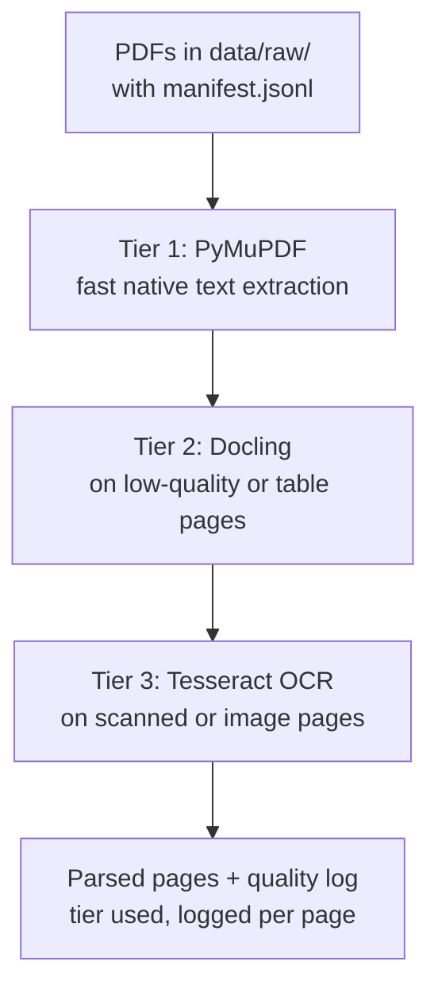
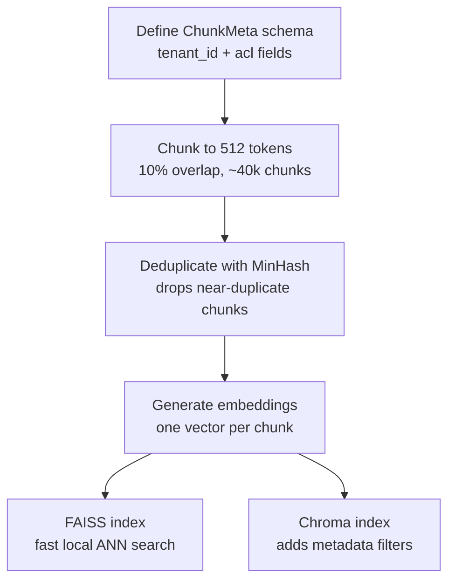

# Phase 1 — Ingestion Architecture

This document describes the ingestion pipeline that turns raw RBI circulars and Master Directions into two queryable vector indexes. It's split into two stages: a **quality-escalating parser** and a **chunk → dedup → embed → dual-index pipeline**.

---

## Stage 1: Three-tier parsing pipeline

### Why a tiered parser instead of one parser

RBI source documents aren't uniform: some are clean, digitally-typeset circulars; Master Directions are dense with tables; older notifications are scanned images with no embedded text layer. A single parser tuned for one of these fails silently on the others — a common cause of garbage-in-garbage-out in RAG pipelines. Escalating through tiers trades some complexity for correctness, and only pays the cost of a slower tier when the faster one demonstrably failed.

### Step details

| Step | Purpose | Notes |
|---|---|---|
| **Download + manifest** | Source PDFs land in `data/raw/`; `manifest.jsonl` records URL and date per file | Manifest is the audit trail for provenance and re-downloads |
| **Tier 1 — PyMuPDF** (`ingest/parse.py`) | Reads the embedded text layer directly — cheapest, fastest path | Most clean circulars should resolve here; this is your baseline |
| **Tier 2 — Docling** | Escalated when Tier 1 output shows mangled tables, scrambled reading order, or suspiciously low text density | Uses a layout model to reconstruct table structure — critical for Master Directions, where interest-rate tables and compliance thresholds carry the actual regulatory content |
| **Tier 3 — Tesseract OCR** | Last resort when a page has no extractable text at all (scanned/faxed notifications) | Slowest, least accurate tier — the point of gating Tiers 1–2 first is to minimize how many pages reach here |
| **Parse quality logging** | Every page records which tier resolved it plus a quality score | Lets you report the tier-split percentage across the corpus, and gives an audit trail if a specific circular later shows bad retrieval quality |

---

## Stage 2: Chunking, dedup, and dual indexing

### Step details

| Step | Purpose | Notes |
|---|---|---|
| **`ChunkMeta` schema (Pydantic)** | Defined *before* chunking so every chunk is born with the right shape | Includes `tenant_id` and `acl` placeholders — baking these in now avoids a full re-embed later when Project 2 needs multi-tenant/ACL-scoped retrieval |
| **Naive chunking (512 tokens, 10% overlap)** | ~40,000 chunks, chunk count and token stats printed | 512 tokens holds a coherent clause or table row-group without diluting the embedding; ~50-token overlap prevents a clause from being unretrievable if it falls on a chunk boundary |
| **MinHash deduplication** | Approximates Jaccard similarity across chunks to drop near-duplicates cheaply | RBI circulars repeat boilerplate headers, disclaimers, and near-identical reissues; exact-hash dedup would miss all of these since they're not byte-identical. Without this, a query can return several copies of the same boilerplate and crowd out the distinct answer |
| **Embedding** | One vector per chunk, embedded once | Shared input to both downstream indexes |
| **FAISS index** | Fast, in-process, dependency-light approximate nearest-neighbor search | Best for raw vector similarity with no filtering overhead |
| **Chroma index** | Vector store with a metadata layer for filtering by `tenant_id`, date, or ACL | Filters directly on the fields `ChunkMeta` already carries — this is what Project 2's tenant-scoped retrieval builds on without re-architecting |

---

## How the two stages connect

Stage 1's job is to maximize how much of the corpus becomes clean, structured text with a known confidence level per page. Stage 2's job is to turn that text into something queryable while keeping every chunk traceable back to its source page, parse tier, and (eventually) tenant scope. The `parse_quality` and `ChunkMeta` records make the pipeline auditable end-to-end rather than a black box — usually the first thing that gets probed when this design is discussed in an interview.
