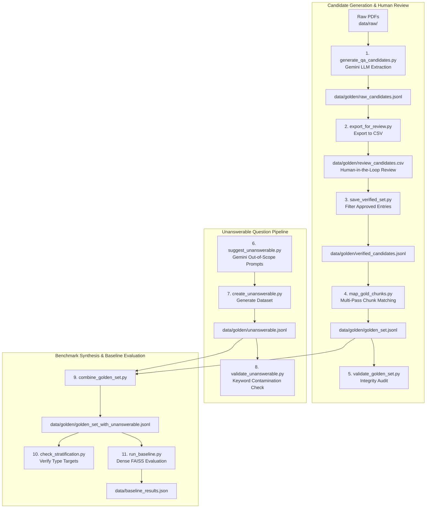

# Phase 2 — Golden Set Dataset & Evaluation Architecture

This document describes the end-to-end architecture and pipeline for constructing the **Golden Evaluation Set** (`data/golden/golden_set_with_unanswerable.jsonl`) and evaluating baseline RAG retrieval performance.

The golden set serves as the ground-truth benchmark for evaluating Retrieval-Augmented Generation (RAG) retrieval accuracy (Recall, Precision, MRR, nDCG) and system abstention capabilities.

---

## 🏗️ End-to-End Pipeline Workflow

---

## 📁 File Breakdown (`scripts/phase2/`)

The `scripts/phase2` module is organized into 5 logical pipeline stages:

### Stage 1: Candidate QA Generation & Inspection
- **`check_gemini.py`**
  - **Purpose**: Diagnostic script to verify the Google Gemini API key configuration and list available generation models (`models/gemini-3.5-flash`, etc.).
  - **Input**: `GEMINI_API_KEY` from `.env`
  - **Output**: Terminal printout of available Gemini models.
- **`generate_qa_candidates.py`**
  - **Purpose**: Main QA generator processing raw PDFs into structured Question-Answer pairs with exact supporting text quotes.
  - **Input**: Raw PDF files in `data/raw/`
  - **Output**: `data/golden/raw_candidates.jsonl`
  - **Key Logic**: Uses `extract_pdf_with_page_tiers()` from `ingest.parse` and prompts Gemini with strict JSON schema instructions across question types (`factoid`, `exact identifier`, `multi-hop`, `comparative`, `temporal`).
- **`inspect_candidates.py`**
  - **Purpose**: Developer CLI tool for inspecting raw Q&A candidates without reading large JSONL files.
  - **Input**: `data/golden/raw_candidates.jsonl`
  - **Output**: Terminal summary of the first 5 generated Q&A pairs.

---

### Stage 2: Human-in-the-Loop Review & Chunk Mapping
- **`export_for_review.py`**
  - **Purpose**: Exports raw candidates to CSV for human annotation and verification.
  - **Input**: `data/golden/raw_candidates.jsonl`
  - **Output**: `data/golden/review_candidates.csv`
  - **Key Logic**: Formats CSV headers with annotation tracking columns (`review_status`, `reviewer_notes`, `corrected_question`, `corrected_answer`, `corrected_quote`).
- **`save_verified_set.py`**
  - **Purpose**: Filters and updates CSV entries after human review.
  - **Input**: `data/golden/review_candidates.csv`
  - **Output**: `data/golden/verified_candidates.jsonl`
  - **Key Logic**: Retains `Accept`/`Revise` entries, applies reviewer corrections, and discards `Reject` entries.
- **`map_gold_chunks.py`**
  - **Purpose**: Maps verified supporting text quotes to exact chunk IDs in `chunks_dedup.jsonl`.
  - **Input**: `data/golden/verified_candidates.jsonl`, `data/processed/chunks_dedup.jsonl`
  - **Output**: `data/golden/golden_set.jsonl`
  - **Key Logic**: Applies a 3-tier matching engine (Exact Substring -> Whitespace Normalized -> Aggressive Regex) scoped by PDF name.
- **`validate_golden_set.py`**
  - **Purpose**: Automated integrity check verifying all `gold_chunk_ids` reference valid, non-empty chunks in `chunks_dedup.jsonl`.
  - **Input**: `data/golden/golden_set.jsonl`, `data/processed/chunks_dedup.jsonl`
  - **Output**: Terminal audit report of valid mappings and anomalies.

---

### Stage 3: Unanswerable Questions Pipeline
- **`suggest_unanswerable.py`**
  - **Purpose**: Uses Gemini to suggest plausible domain-specific questions that are realistic for compliance officers but outside the corpus scope.
  - **Input**: Gemini API
  - **Output**: Terminal list of proposed out-of-scope question prompts.
- **`create_unanswerable.py`**
  - **Purpose**: Constructs the dataset of 20 out-of-scope questions with empty gold chunk IDs and quotes to test RAG abstention.
  - **Input**: Selected Gemini prompts & supplementary domain questions
  - **Output**: `data/golden/unanswerable.jsonl`
- **`validate_unanswerable.py`**
  - **Purpose**: Scans `unanswerable.jsonl` against `chunks_dedup.jsonl` to ensure unanswerable questions do not inadvertently exist in the corpus.
  - **Input**: `data/golden/unanswerable.jsonl`, `data/processed/chunks_dedup.jsonl`
  - **Output**: Terminal alert on potential corpus keyword collisions.

---

### Stage 4: Benchmark Synthesis & Stratification Check
- **`combine_golden_set.py`**
  - **Purpose**: Merges answerable questions (`golden_set.jsonl`) and unanswerable questions (`unanswerable.jsonl`) into a unified golden dataset.
  - **Input**: `data/golden/golden_set.jsonl`, `data/golden/unanswerable.jsonl`
  - **Output**: `data/golden/golden_set_with_unanswerable.jsonl`
- **`check_stratification.py`**
  - **Purpose**: Validates that question type counts satisfy target benchmark distributions.
  - **Input**: `data/golden/golden_set_with_unanswerable.jsonl`
  - **Output**: Terminal summary table comparing actual counts against target thresholds (`factoid`: 80, `exact identifier`: 20, `multi-hop`: 35, `comparative`: 15, `temporal`: 10, `unanswerable`: 20).

---

### Stage 5: Evaluation Engine & Dense Retrieval Baseline
- **`retrieval_eval/`** (`__init__.py`, `retrieval_metrics.py`)
  - **Purpose**: Pure Python metric computation library for RAG evaluation (no LLM calls required).
  - **Metrics**: Computes Recall@k, Precision@k, MRR, and nDCG@k.
- **`run_baseline.py`**
  - **Purpose**: Evaluates naive dense retrieval (FAISS Flat + BGE-base-en-v1.5) over answerable questions to establish the baseline performance benchmark.
  - **Input**: `data/golden/golden_set_with_unanswerable.jsonl`, `data/indexes/faiss.index`, `data/indexes/metadata.json`
  - **Output**: `data/baseline_results.json` and terminal metrics report.

---

## 📊 Summary of Data Artifacts

| Artifact Path | Format | Produced By | Purpose |
|---|---|---|---|
| `data/golden/raw_candidates.jsonl` | JSONL | `generate_qa_candidates.py` | Raw LLM-generated Q&A pairs with quotes |
| `data/golden/review_candidates.csv` | CSV | `export_for_review.py` | Spreadsheet for human-in-the-loop annotation |
| `data/golden/verified_candidates.jsonl` | JSONL | `save_verified_set.py` | Approved & corrected Q&A entries |
| `data/golden/golden_set.jsonl` | JSONL | `map_gold_chunks.py` | Answerable Q&A pairs with mapped `gold_chunk_ids` |
| `data/golden/unanswerable.jsonl` | JSONL | `create_unanswerable.py` | Ground-truth out-of-scope queries for abstention evaluation |
| `data/golden/golden_set_with_unanswerable.jsonl` | JSONL | `combine_golden_set.py` | Unified ground-truth evaluation benchmark |
| `data/baseline_results.json` | JSON | `run_baseline.py` | Benchmark performance baseline metrics |

---

## 🔑 Design Principles & Key Highlights

1. **Exact Quote Grounding**: Q&A candidates require exact source quotes (`supporting_quote`) to prevent hallucinated ground truths.
2. **Robust Multi-Pass Chunk Mapping**: 3-tier string matching guarantees high chunk mapping precision despite OCR noise or formatting differences.
3. **Negative Constraint Benchmarking**: Dedicated unanswerable query validation guarantees evaluation coverage for RAG hallucination and abstention behaviors.
4. **Deterministic Metrics Engine**: Pure mathematical evaluation module (`retrieval_eval`) enables fast, reproducable baseline & ablation evaluations.
