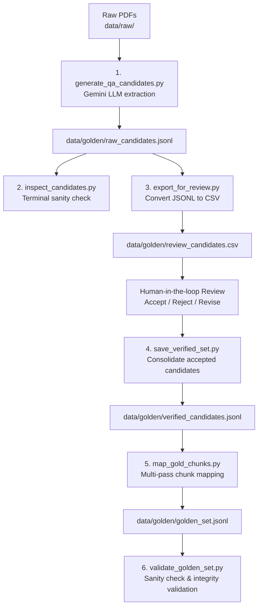

# Phase 2 — Golden Set Dataset Pipeline Architecture

This document describes the pipeline that constructs the **Golden Evaluation Set** (`data/golden/golden_set.jsonl`) from raw PDF documents and deduplicated text chunks (`data/processed/chunks_dedup.jsonl`). 

The golden set serves as the ground-truth benchmark for evaluating Retrieval-Augmented Generation (RAG) retrieval accuracy, context precision, context recall, and response generation quality (e.g., via RAGAS / DeepEval).

---

## 🏗️ End-to-End Pipeline Overview

---

## 📁 File Breakdown (`scripts/phase2/`)

Each file in `scripts/phase2` performs a dedicated step in the candidate generation, review export, chunk mapping, and validation lifecycle:

### 1. `check_gemini.py`
- **Purpose**: Diagnostic script to verify the Google Gemini API key configuration and list available models supporting text generation (`generateContent`).
- **Input**: `GEMINI_API_KEY` from `.env`
- **Output**: Terminal printout of available Gemini models (e.g., `models/gemini-1.5-flash`, `models/gemini-3.5-flash`).
- **Key Logic**: Initializes `google.generativeai` and iterates over supported generation methods.

---

### 2. `generate_qa_candidates.py`
- **Purpose**: Core candidate generator that processes PDF documents and uses Gemini to extract structured Question-Answer pairs along with exact supporting quotes.
- **Input**: Raw PDF files in `data/raw/`
- **Output**: `data/golden/raw_candidates.jsonl`
- **Key Logic**:
  - Uses `extract_pdf_with_page_tiers()` from `ingest.parse` to extract page text.
  - Prompts Gemini (`gemini-3.5-flash` / `1.5-flash`) with strict JSON schema instructions to generate diverse question types (`factoid`, `exact_identifier`, `multi_hop`, `comparative`, `temporal`).
  - Requires Gemini to extract an **exact supporting quote** (`supporting_quote`) from the document text.
  - Implements rate limiting and jitter delay (`time.sleep(4 + jitter)`) to respect API rate limits (15 RPM).

---

### 3. `inspect_candidates.py`
- **Purpose**: Developer utility script to quickly inspect generated Q&A candidates without opening large JSONL files.
- **Input**: `data/golden/raw_candidates.jsonl`
- **Output**: Formatted stdout showing the first 5 generated Q&A pairs (Question, Answer, Quote, Type, Source PDF).
- **Key Logic**: Reads JSONL line-by-line and prints structured fields to stdout.

---

### 4. `export_for_review.py`
- **Purpose**: Converts raw JSONL candidates into a user-friendly CSV file formatted for human-in-the-loop review and annotation.
- **Input**: `data/golden/raw_candidates.jsonl`
- **Output**: `data/golden/review_candidates.csv`
- **Key Logic**: Writes CSV headers with evaluation tracking fields:
  - `review_status` (`Accept` / `Reject` / `Revise`)
  - `reviewer_notes`
  - `corrected_question`, `corrected_answer`, `corrected_quote`

---

### 5. `save_verified_set.py`
- **Purpose**: Processes the human-reviewed CSV and outputs a clean JSONL dataset of approved or revised Q&A candidates.
- **Input**: `data/golden/review_candidates.csv`
- **Output**: `data/golden/verified_candidates.jsonl`
- **Key Logic**:
  - Filters rows with status `Accept` or `Revise` (defaults to `Accept` if unreviewed).
  - Overwrites original question/answer/quote fields with corrected values if provided by the reviewer.
  - Excludes `Reject` candidates.

---

### 6. `map_gold_chunks.py`
- **Purpose**: Maps supporting text quotes in verified Q&A pairs to actual chunk IDs in the deduplicated vector store corpus (`chunks_dedup.jsonl`).
- **Input**: 
  - `data/golden/verified_candidates.jsonl`
  - `data/processed/chunks_dedup.jsonl`
- **Output**: `data/golden/golden_set.jsonl`
- **Key Logic**: Uses a 3-tier progressive string matching algorithm scoped by PDF name:
  1. **Pass 1 — Exact Substring**: Searches for exact quote string in chunks.
  2. **Pass 2 — Whitespace Normalized**: Collapses newlines/extra spaces before matching.
  3. **Pass 3 — Aggressive Regex**: Strips punctuation and converts to lowercase before matching.
  4. **Fallback**: Removes PDF-scope filtering if no match was found in the target document.

---

### 7. `validate_golden_set.py`
- **Purpose**: Final automated audit script to verify dataset integrity and prevent broken ground-truth references.
- **Input**: 
  - `data/golden/golden_set.jsonl`
  - `data/processed/chunks_dedup.jsonl`
- **Output**: Terminal summary of validity metrics (Valid Mappings, Mismatches, Empty Gold IDs, Out-of-Bounds Chunk IDs).
- **Key Logic**: Iterates over every gold chunk ID in `golden_set.jsonl` and validates that the chunk ID exists in `chunks_dedup.jsonl` and contains the corresponding supporting quote.

---

## 📊 Summary of Data Artifacts

| Artifact Path | Format | Produced By | Purpose |
|---|---|---|---|
| `data/golden/raw_candidates.jsonl` | JSONL | `generate_qa_candidates.py` | Raw LLM-generated Q&A pairs with quotes |
| `data/golden/review_candidates.csv` | CSV | `export_for_review.py` | Human-in-the-loop spreadsheet for annotation |
| `data/golden/verified_candidates.jsonl` | JSONL | `save_verified_set.py` | Filtered & corrected Q&A entries |
| `data/golden/golden_set.jsonl` | JSONL | `map_gold_chunks.py` | Final ground-truth evaluation benchmark containing `gold_chunk_ids` |

---

## 🔑 Design Principles & Key Highlights

1. **Exact Quote Grounding**: Candidates require exact quotes (`supporting_quote`) from source PDFs, preventing hallucinated Q&A pairs.
2. **Robust Multi-Pass Chunk Mapping**: Combining exact, normalized, and regex matching ensures high chunk-mapping success rates despite OCR or whitespace formatting discrepancies.
3. **Auditability & Integrity**: Human-in-the-loop review combined with `validate_golden_set.py` guarantees zero dangling references or corrupt evaluation data.
