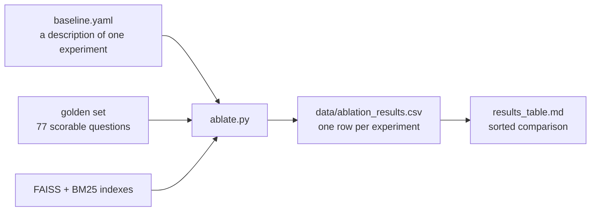
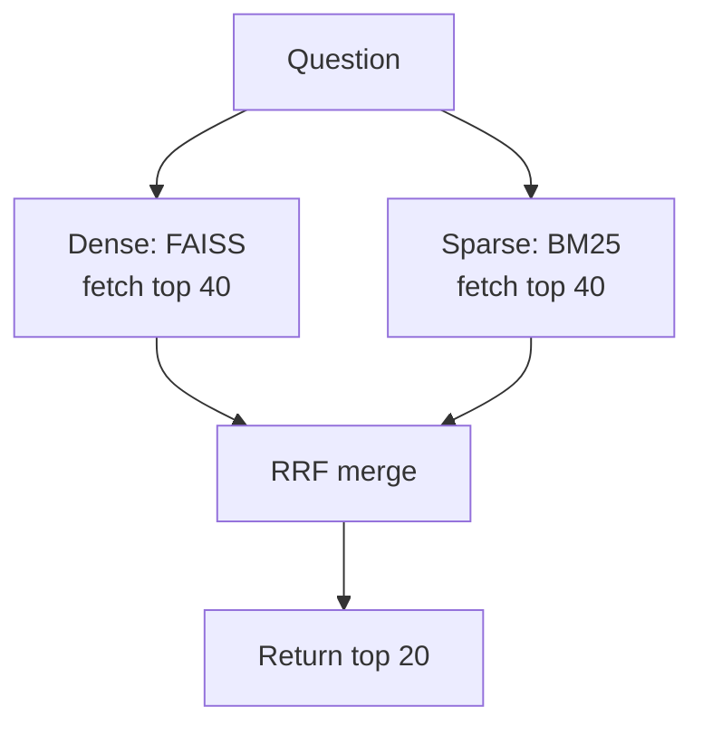
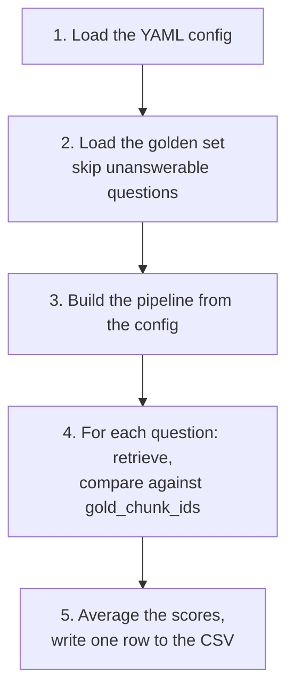
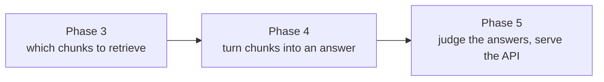

# Phase 3 — Retrieval & Ablation Architecture

This document explains, in plain language, **how the project searches for answers**, **why an experiment is a config file instead of a code change**, and **what every file in `scripts/phase3/` does**.

Phase 1 built the indexes. Phase 2 built the ruler. Phase 3 is where the actual question gets answered: **which way of searching works best?**

---

## 1. The one idea to hold on to

> **An experiment is a YAML file, not a code edit.**

Most RAG projects tune retrieval by editing the search code, running it, eyeballing the output, and editing again. Nothing is recorded, nothing is comparable, and "it felt better" is the only evidence.

Phase 3 makes that impossible. To try a new idea you write a small config file describing the setup, run one command, and a row of numbers is appended to a results table. The code never changes.



Because every run writes into the same CSV, and every run is scored against the same questions, the rows are directly comparable. That is the whole point of the phase.

---

## 2. The three ways of searching

Phase 3 implements three retrieval modes. You choose one with a single line in the config: `retrieval_type: dense | sparse | hybrid`.

### Dense — search by meaning

```
question → 768 numbers → find the closest chunk vectors in FAISS
```

Your question is converted to a vector by the same model that embedded the chunks (`BAAI/bge-base-en-v1.5`), then FAISS returns the chunks whose vectors sit closest.

**Good at:** questions worded differently from the document. Ask *"how much money can I send abroad?"* and it can find a chunk saying *"remittance limits for individuals"* — no shared words, same meaning.

**Bad at:** exact identifiers. `FED Master Direction No. 9/2015-16` has no "meaning" for the model to capture, so the vector it produces is close to useless.

### Sparse — search by exact words

```
question → stem the words → look them up in the BM25 index
```

No AI model involved. BM25 scores each chunk on how well its words match the query's words, weighting rare words far more heavily than common ones.

**Good at:** exactly what dense search is bad at — circular numbers, section references, precise legal phrases.

**Bad at:** rephrasing. If the document says "remittance" and you ask about "sending money", BM25 finds nothing.

### Hybrid — run both, then merge

```
question → dense search AND sparse search → merge the two ranked lists
```

Dense and sparse fail on **opposite** things. Running both and combining them means the pair covers each other's weaknesses. This is the project's central hypothesis, and Phase 3 exists to test whether it's actually true.



Note the over-fetching: for a final list of 20, each retriever is asked for 40 candidates first (`dense_k = min(k * 2, 200)`). You need a wider pool going in, because the merge will reorder and drop things.

---

## 3. How the merge works (RRF)

This is the cleverest part of Phase 3 and worth understanding properly.

### The problem

Dense search returns cosine similarities — numbers roughly between 0 and 1. BM25 returns relevance scores on a completely different, unbounded scale that depends on the corpus. A dense score of 0.8 and a BM25 score of 12.4 are **not comparable**. Averaging them is like averaging a temperature in Celsius with a distance in miles — the arithmetic works, the result is meaningless.

### The solution

**Ignore the scores entirely. Use only the positions.**

Reciprocal Rank Fusion asks one question of each list: *where did this chunk rank?* Then it awards points:

```python
score(chunk) = sum over both lists of   1 / (60 + rank_in_that_list)
```

A chunk at rank 1 earns `1/61 = 0.01639`. Rank 2 earns `1/62 = 0.01613`. Rank 3 earns `1/63 = 0.01587`. Small, close-together numbers — deliberately.

### A worked example

Query: *"reporting requirement for insurance"*

| | Dense (FAISS) returns | Sparse (BM25) returns |
|---|---|---|
| rank 1 | chunk 47 | chunk 2 |
| rank 2 | chunk 2 | chunk 103 |
| rank 3 | chunk 891 | chunk 47 |

Adding up the points:

| Chunk | Dense points | Sparse points | Total | Final rank |
|---|---|---|---|---|
| **2** | rank 2 → 0.01613 | rank 1 → 0.01639 | **0.03252** | **1st** |
| **47** | rank 1 → 0.01639 | rank 3 → 0.01587 | **0.03226** | 2nd |
| 103 | — | rank 2 → 0.01613 | 0.01613 | 3rd |
| 891 | rank 3 → 0.01587 | — | 0.01587 | 4th |

**Chunk 2 wins — even though neither search ranked it first overall.** It was found by *both*. Chunk 47 was first in the dense list but only third in the sparse one, so it loses narrowly.

That is exactly the behaviour we want: **agreement between two different search methods is stronger evidence than being the favourite of one.**

### What the 60 is for

The `k = 60` constant (from the original RRF paper) flattens the gaps between ranks. Because 1/61, 1/62 and 1/63 are so close together, appearing in *both* lists matters far more than the exact position within either.

- **Bigger k** → flatter still → even more reward for appearing in both lists
- **Smaller k** → sharper → more reward for being at the very top of one list

It's a tunable knob (`rrf_k` in the config), and testing other values is a natural next experiment.

---

## 4. The files in `scripts/phase3/`

```
scripts/phase3/
├── config_loader.py              defines what a valid experiment looks like
├── build_bm25_index.py           builds the keyword index (see INDEXING_ARCHITECTURE.md)
├── commands.md                   how to run things
└── config/
    ├── baseline.yaml             experiment 1: dense only
    ├── hybrid_rrf.yaml           experiment 2: dense + BM25 with RRF
    ├── retrieval_pipeline.py     the actual searching
    ├── ablate.py                 the experiment runner
    ├── generate_results_table.py turns the CSV into a markdown table
    └── compare_results.py        prints a quick comparison
```

### `config_loader.py` — the rulebook

Defines `RetrievalConfig`, a Pydantic model listing every knob an experiment can set, with its allowed values and default. It exists so that a typo in a YAML file fails immediately with a clear error, instead of silently running the wrong experiment and producing a number you then trust.

```python
retrieval_type: Literal["dense", "sparse", "hybrid"] = "dense"
index_type: Literal["flat", "hnsw", "ivf"] = "flat"
rrf_k: Optional[int] = 60
```

### `retrieval_pipeline.py` — the searcher

A single class, `RetrievalPipeline`, that takes a config and does the searching. On construction it loads the embedding model, the FAISS index, `metadata.json`, and — only if the config needs them — the BM25 index and its tokenizer settings.

It exposes one method that matters:

```python
pipeline.retrieve(query, k)  →  [2, 47, 103, ...]   # a list of chunk IDs
```

Everything else in the class is private helpers: `_load_bm25`, `_tokenize_query`, `_reciprocal_rank_fusion`.

**Why it returns bare integers:** those chunk IDs are the common language of the whole project. Line 2 of `chunks_dedup.jsonl` = FAISS row 2 = BM25 document 2 = `gold_chunk_ids: [2]` in the golden set. Returning IDs means the scoring step needs to know nothing at all about how the search was performed.

One detail worth noting: `_tokenize_query` reads `tokenizer_config.json` from the BM25 index folder so the query is stemmed **exactly** the way the documents were. If the index stored `report` and the query searched for `reporting`, there would be no match at all.

### `ablate.py` — the runner

The conductor. Five steps:



Two filters are applied when loading questions, and both matter:

```python
if not q.get('is_unanswerable', False):   # skip the 14 abstention questions
...
if not gold_ids: continue                 # skip questions with no mapped chunks
```

The first is correct — an unanswerable question has no right chunk to find, so retrieval metrics don't apply to it. The second silently drops **23 of the 100 answerable questions**, because `map_gold_chunks.py` could not match their quote back to a chunk. What reaches scoring is **77 questions**.

On writing results, the runner removes any existing row with the same `experiment_name` before appending:

```python
existing = existing[existing['experiment_name'] != config.experiment_name]
```

So re-running an experiment **updates** its row rather than adding a duplicate. Results stay comparable across repeated runs.

### `generate_results_table.py` — the presenter

Reads the CSV, keeps three columns (`recall@10`, `mrr`, `ndcg@10`), sorts by `recall@10` descending, writes `data/results_table.md`. Purely cosmetic — it creates no new information.

### `compare_results.py` — a six-line scratch script

Prints the same three columns for three named experiments. Note that it looks for `bm25_only`, which **does not exist** — there is no sparse-only YAML config in the repo, so that experiment has never been run.

---

## 5. What the config file controls

Here is `baseline.yaml`, annotated:

```yaml
experiment_name: "baseline_dense_flat"      # the row name in the CSV
description: "Dense retrieval only with FAISS Flat (exact cosine)"

embedding_model: "BAAI/bge-base-en-v1.5"    # which model turns text into vectors
normalize_embeddings: true                  # makes inner product = cosine similarity

index_type: "flat"                          # flat = exact, no approximation
faiss_index_path: "data/indexes/faiss.index"

retrieval_type: "dense"                     # dense | sparse | hybrid
sparse_index_path: null                     # not needed for dense-only
retrieve_k: 100                             # how many candidates to fetch

reranker: null                              # not implemented yet
query_transform: null                       # not implemented yet
diversity_filter: null                      # not implemented yet

k_values: [1, 5, 10, 20]                    # score at these cut-offs
```

And `hybrid_rrf.yaml` differs in only four meaningful lines:

```yaml
retrieval_type: "hybrid"
hybrid_fusion: "rrf"
rrf_k: 60
sparse_index_path: "data/indexes/bm25_index"
```

**That is the entire difference between the two experiments in the results table.** No code was edited to produce the second row.

### Knobs declared but not yet built

`RetrievalConfig` describes the full ambition of the phase, not only what works today:

| Setting | What it would do | Built? |
|---|---|---|
| `retrieval_type` | dense / sparse / hybrid | **Yes** |
| `hybrid_fusion: rrf` | merge two lists by rank | **Yes** |
| `rrf_k` | tune the fusion constant | **Yes** |
| `retrieve_k`, `k_values` | pool size and scoring cut-offs | **Yes** |
| `index_type: hnsw / ivf` | faster approximate FAISS indexes | No — always reads the prebuilt Flat index |
| `hybrid_fusion: weighted` | merge by weighted score instead of rank | No |
| `reranker` | re-score top candidates with a slower, sharper model | No |
| `query_transform` | rewrite the question before searching (HyDE, multi-query) | No |
| `diversity_filter: mmr` | stop all results being near-copies | No |
| `chroma_collection` | search Chroma instead of FAISS | No — declared and set, never read |
| `embedding_model` | swap the embedding model | Partly — it loads whatever you name, but `faiss_index_path` still points at an index built with BGE, so changing the model alone would compare a new query vector against old chunk vectors |

Setting an unimplemented option does **not** raise an error — it is accepted and silently ignored. Worth knowing before you trust a row.

---

## 6. How the scoring works

Every question is scored by comparing what the retriever returned against the `gold_chunk_ids` from Phase 2. Four metrics, all pure arithmetic — no AI model, no human judgement, free to run as often as you like.

| Metric | The plain-language question it answers |
|---|---|
| **Recall@k** | Of the chunks that *should* have been found, what fraction appeared in the top k? — *"did we find the answer at all?"* |
| **Precision@k** | Of the k chunks we returned, what fraction were correct? — *"how much noise did we return?"* |
| **MRR** | How high up was the **first** correct chunk? 1.0 = first place, 0.5 = second, 0.33 = third |
| **nDCG@k** | Like recall, but rewards correct chunks for appearing **higher** in the list |

### A warning about the precision numbers

Precision looks alarmingly low in the results — around 0.10 at k=20. **This is expected and not a problem.**

Each question has on average only **2 correct chunks**. If you return 20 results and 2 of them are right, precision is 2/20 = 0.10 — and that is the *perfect* score. The ceiling is set by the question, not the retriever. Hybrid's measured `precision@20` of 0.097 is essentially at that ceiling.

**Recall and MRR are the metrics to read here.** Precision only becomes meaningful once a reranker exists to cut 20 candidates down to a final 8.

---

## 7. Running it

All commands must be run from the `window/` directory — the scripts use relative paths like `data/golden/...`.

**Run one experiment:**
```bash
python scripts/phase3/config/ablate.py --config scripts/phase3/config/baseline.yaml
```

**Run every experiment in the config folder:**
```bash
python scripts/phase3/config/ablate.py --all
```

**Rebuild the summary table afterwards:**
```bash
python scripts/phase3/config/generate_results_table.py
```

**Rebuild the BM25 index** (only needed if the chunks change):
```bash
python scripts/phase3/build_bm25_index.py
```

---

## 8. Results so far

Two experiments have been run, both scored on the same 77 questions:

| Experiment | Recall@1 | Recall@10 | Recall@20 | MRR | nDCG@10 |
|---|---|---|---|---|---|
| `baseline_dense_flat` | 0.238 | 0.702 | 0.870 | 0.420 | 0.477 |
| `hybrid_rrf_k60` | 0.345 | **0.857** | **0.968** | **0.544** | **0.611** |

Reading this in plain language:

- **Recall@10 rose from 70% to 86%.** Out of every 10 answers the dense-only search missed, hybrid finds about 5 of them.
- **MRR rose from 0.42 to 0.54.** The first correct chunk now sits around position 2 on average, instead of position 2.4 — meaningful, because a generator reads only the top few.
- **Recall@20 reached 0.968.** Nearly every answer is somewhere in the top 20. That is the signal that **a reranker is the right next step**: the correct chunk is almost always in the pool, it just isn't at the top yet. Reranking is exactly the tool for that, and it is the largest available gain still on the table.

The project's core hypothesis — hybrid beats dense on regulatory text — is supported by these numbers.

---

## 9. Current status — honest notes

**Only two of the planned experiments exist.** The phase was designed around an ablation *matrix*: embedding models, index types, chunk sizes, reranking on/off, Matryoshka truncation. Two configs have been written. Notably there is no `bm25_only` config, so **sparse-only has never been measured** — which means we cannot yet say how much of hybrid's gain comes from BM25 alone versus the fusion. `compare_results.py` already expects that row.

**`results_table.md` is stale.** It contains only the baseline row. `generate_results_table.py` was not re-run after the hybrid experiment, so the tracked summary table is missing the better result. The CSV is correct; the markdown is behind.

**23 questions are dropped silently.** `ablate.py` skips any question whose quote could not be mapped to a chunk. It logs the count it *loaded* but never reports the count it *skipped*, so 100 answerable questions quietly become 77 scored ones.

**Abstention is not measured in Phase 3.** The 14 unanswerable questions are filtered out, correctly — retrieval metrics cannot score them. But that means the abstention behaviour they were written for remains untested until Phase 4 builds the generator and its "I don't know" gate.

**The two configs are not perfectly matched.** `baseline.yaml` sets `retrieve_k: 100` while `hybrid_rrf.yaml` sets `retrieve_k: 20`. Since all scoring happens at k ≤ 20, this does not distort the comparison — but the inconsistency is a trap if a future experiment scores at k=50.

**The corpus caveat still applies.** As noted in the Phase 1/2 review, a portion of the scored questions were generated from bot-challenge pages that the downloader saved as PDFs rather than from actual regulation. Those questions are unusually easy for keyword search, since they hinge on a unique numeric string. The hybrid-beats-dense conclusion is plausible and consistent with theory — but the *size* of the gap should not be quoted until the corpus is cleaned and both experiments are re-run.

---

## 10. Where Phase 3 leads



Phase 3's job ends at a ranked list of chunk IDs. It never writes a sentence and never calls a generation model — which is deliberate. Retrieval failure and generation failure are different bugs with different fixes, and keeping them in separate phases keeps them separately measurable.

The natural next steps within Phase 3 itself, in order of likely payoff:

1. **Add a `bm25_only` config** — needed to attribute hybrid's gain correctly.
2. **Add a reranker** — Recall@20 of 0.968 versus Recall@1 of 0.345 says the answers are in the pool but badly ordered. This is the biggest gain available.
3. **Sweep `rrf_k`** — a one-line config change per run.
4. **Compare index types** — `hnsw` and `ivf` against the exact `flat` baseline.
